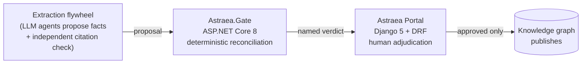
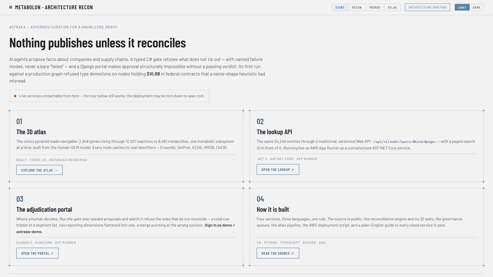
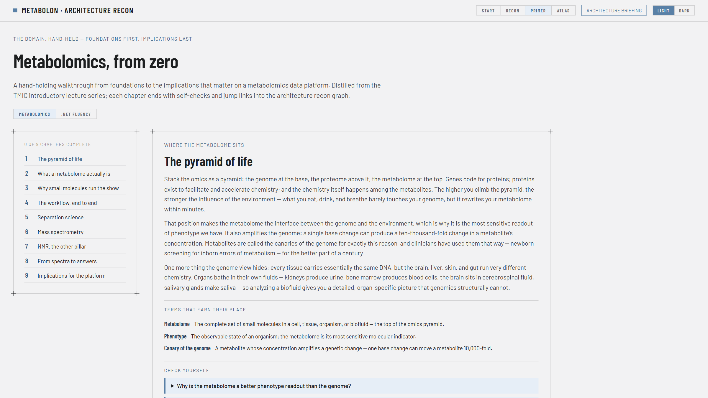
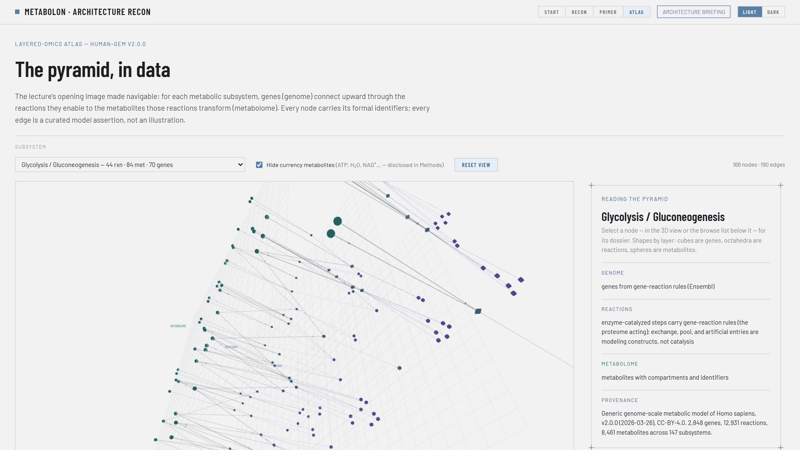

# Astraea — a governed curation plane for an AI-augmented knowledge graph

AI proposes. A typed service verifies. A human governs. Only then does the graph publish.

<p>
  
  
  
  
  
</p>

> **In one minute.** Astraea is quality control for AI-generated facts. A modern language
> model can read thousands of regulatory filings and propose facts like *"Company A supplies
> Company B"* or *"Segment X earned $2.1B"* — and it can also produce numbers that look
> right and are wrong. Astraea is the machinery that stands between those proposals and a
> database people trust: a deterministic C# service that re-checks every number against the
> filing it came from, a Django portal where a human approves or rejects each proposal, and
> a rule enforced *in code* that nothing can be approved without a passing check.
> **AI drafts. Code verifies. A person signs.** Everything below is that sentence, built.

Astraea is the governance apparatus pattern extracted from [Thessa](https://thessa.space),
a supply/value-chain knowledge graph whose value is that the numbers in it are **true**.
An autonomous extraction flywheel can propose thousands of facts; the one thing it must
never be able to do is publish a plausible wrong number. Astraea is the pair of services
that stand between a proposal and the graph:



- **`gate/` — Astraea.Gate (C# / ASP.NET Core 8).** A deterministic reconciliation
  service: segment revenue publishes only if it ties to the consolidated figure in the
  same filing. Failures come back *named*, never lumped. Deterministic validation wants
  a compiler — the domain is typed records, the rules are LINQ, the suite is xUnit.
- **`portal/` — the adjudication portal (Python / Django 5 + DRF).** The human gate:
  a governed review queue over proposals, their provenance, and their gate verdicts.
  Human-in-the-loop curation is a CRUD-and-permissions problem, and the Django admin is
  the best CRUD-and-permissions machine ever shipped — approve/reject actions, failure-mode
  filters, and a hard refusal to approve anything the gate has not passed.



## Why the gate exists

Real failure shapes this system is built around, learned by shipping something wrong:

| verdict | what actually happened |
|---|---|
| `undetected_rollup` | A "Total" row rode along in the extracted list — every row correct, the sum exactly double. This is how a naive segment sum ends up +126%. |
| `duplicate_facts` | Geography *and* product dimensions flattened into one list — each dollar counted twice, the sum lands at a perfectly plausible 2x. |
| `no_consolidated` | Rows exist but the anchor figure from the same filing is missing. An unanchored sum is unverifiable, so it must not publish. |
| `unreconciled` | Every row looks reasonable; the sum is off by 26%. Absence is honest — a plausible wrong figure is undetectable downstream. |
| `no_segments` | Nothing to reconcile. Say so, loudly. |

The portal enforces the other half of the contract: **approval is structurally impossible
without a passing gate verdict** — not a convention, a refusal in code (HTTP 409 on the
API, a hard error message in the admin).

## Run it

The fastest path is containers — the same images the AWS deployment ships
(architecture and rationale in [docs/DEPLOYMENT.md](docs/DEPLOYMENT.md); what each
AWS service actually does and costs in [docs/AWS_STACK.md](docs/AWS_STACK.md); where the architecture goes next in [docs/AWS_ROADMAP.md](docs/AWS_ROADMAP.md));
the portal bakes a fresh seeded demo database at build time (login `demo` /
`astraea-demo`):

```bash
docker compose up --build
```

Or natively — two processes, no shared infrastructure; the portal reaches the
gate over HTTP.

**Gate** (needs .NET 8 SDK):

```bash
dotnet test gate/Astraea.sln
```

```bash
dotnet run --project gate/Astraea.Gate --urls http://localhost:5210
```

**Portal** (needs Python 3.12+):

```bash
python -m venv .venv && .venv/Scripts/pip install -r portal/requirements.txt
```

```bash
cd portal && ../.venv/Scripts/python manage.py migrate && ../.venv/Scripts/python manage.py seed_proposals && ../.venv/Scripts/python manage.py createsuperuser && ../.venv/Scripts/python manage.py test && ../.venv/Scripts/python manage.py runserver 8642
```

Then open `http://localhost:8642/admin/` → Proposals → select all → action
**"Run reconciliation gate (.NET)"** → watch seven verdicts come back. Try to approve
`Corvid Dynamics` and the portal refuses: *nothing publishes unless it reconciles.*
Approve `Apple Inc.` and it goes through with your name on the review.

Django's default port 8000 sits inside a Windows excluded-port range on some machines;
any port works (`runserver 8642`). The gate URL is configurable via `ASTRAEA_GATE_URL`.

## Two modes: seeded demo, or a live graph

Out of the box Astraea runs on the seeded public data below. Pointed at a live
Thessa graph (`THESSA_GATE_URL`-style env: `THESSA_KG_DB`), three commands put
the **real** backlog through the same governance — strictly read-only; the
connector opens SQLite in `mode=ro` and decisions leave as a JSON log
(`manage.py export_decisions`) for the graph's own dry-run-by-default sweeps
to apply:

```bash
python manage.py import_kg        # ontology census + pending drafts + retypes, with per-node substance
python manage.py run_gate         # batch the .NET gate over every queue
python manage.py export_decisions # decisions out as a JSON log; Astraea never writes the graph
```

Substance is counted across **every** node-referencing column, enumerated from
a single authoritative list filtered against the connected schema — because
hand-written subsets of that list once called $134.7B of federal contracts
"orphans."

### What happened the first time this ran against the real graph

`import_kg` brought in 1,083 pending supply edges and 20 pending node retypes.
The gate passed every edge — and refused **14 of the 20 retypes** as
`substance_demotion`: a name-shape heuristic ("article/quantifier-led phrase,
not a discrete entity") was proposing to demote, among others, The Aerospace
Corporation (213 federal contracts, $9.1B), Two Six Labs ("Two" read as a
quantifier — $438M), and Five Stones Research ($154M). In total: nodes holding
~$10.9B across 632 federal contracts, all public USAspending data. Provenance
beats name shape; the gate makes that a refusal instead of a memory.

The six that passed hold no contracts and almost no edges — and that is the
gate's honest boundary: it refuses *provable* errors and leaves judgment calls
(The MathWorks with three edges and no contracts) to the human reviewer it
feeds. A gate is a floor, not a verdict.

## Ontology law (the identity rules, typed)

Beyond revenue reconciliation, the gate enforces the graph's identity rules:

| endpoint | refuses | rule |
|---|---|---|
| `POST /validate-edge` | `self_edge`, `usd_column_carries_foreign_currency`, `unscoped_id`, `multi_maker_product` | a yen figure in a USD column reads as ~150x; ids scope to their owner; a product has exactly one maker |
| `POST /validate-merge` | `bare_name_merge`, `merge_direction_suspect` | never merge a bare surname or acronym on name evidence (PRATT & MILLER is not Pratt & Whitney); survivors are chosen on substance |
| `POST /validate-retype` | `substance_demotion` | nodes holding contracts, tickers, or identity bridges cannot be demoted to "generic" |

## Calibrated confidence (powerscope's conformal pattern)

*Plain English first: when the AI says "I'm 84% sure", that's a self-report, not a
measurement. This section converts self-reports into evidence — by checking, over
1,691 human-adjudicated cases, how often each level of claimed confidence was actually
upheld — so a downstream consumer can act on a probability that has been earned.*

An extraction confidence is an assertion; the gate turns it into a measurement.
`manage.py calibrate_confidence` fits a split-conformal table (deciles of raw
confidence -> empirical adjudicator precision, monotone by cumulative max) from
real verified/rejected outcomes, and `/validate-edge` verdicts then carry
`calibrated_confidence` alongside the raw value. Fitted on 1,691 adjudicated
drafts, the current table's held-out validation gap is 0.118 — and the finding
is that the flywheel is *underconfident*: raw 0.84 extractions are upheld 86.9%
of the time, and everything above is ~1.0. The same algorithm is implemented
independently in Python (`portal/adjudication/calibration.py`) and C#
(`gate/Astraea.Gate/Calibration.cs`), with one shared fixture pinned in both
test suites so the implementations must agree.

## The seed data is honest

Two proposals are real — Apple and Microsoft FY2023 reportable segments in **whole USD**,
tying exactly to the consolidated revenue of the same 10-K, with EDGAR provenance links.
Five are synthetic, each modeling one failure mode, and every one is *labeled* synthetic
in the data, the UI, and its citation-check text. Real and fake are never mixed
undeclared — in a system whose product is trust, the demo data holds the same bar.

## The AI layer

Each seeded proposal carries an **independent citation check** — a summary written by an
agent that sees only the proposal and its source, never the extractor's reasoning.
Precomputed text ships in the seed so the demo runs without any API key;
`manage.py citation_check` regenerates them live against the Anthropic API when
`ANTHROPIC_API_KEY` is set (and says exactly that, rather than failing silently, when it
isn't).

This is the division of labor the system argues for: **agents draft and cross-examine,
deterministic code verifies, humans own publication.** The AI is load-bearing for
throughput, never for truth.

## API surface

| service | endpoint | what |
|---|---|---|
| gate | `POST /reconcile` | proposal in, named verdict out (snake_case JSON) |
| gate | `GET /failure-modes` | the failure vocabulary, with definitions |
| gate | `GET /healthz` | liveness |
| portal | `GET /api/proposals/` | the adjudication queue (DRF, read-only) |
| portal | `POST /api/proposals/{id}/gate/` | run the gate for one proposal (auth) |
| portal | `POST /api/proposals/{id}/adjudicate/` | `{"decision": "approve"\|"reject"}` (auth; approve 409s without a passing verdict) |

## Design rules inherited from the parent project

- **Verify against real bytes.** The gate's tests include real filings, and this README's
  walkthrough was executed, not imagined.
- **A wrong number is worse than no number.** The whole apparatus exists to prefer
  a confident absence over a plausible error.
- **Name the failure modes.** `undetected_rollup` can be triaged; "failed" cannot.
- **A catch that returns null must say something.** If the gate is down, the portal says
  *gate unreachable*, in red, and changes nothing — it never degrades into a quiet pass.
- **Money travels in whole units.** `revenue_usd` is whole dollars; a scale riding in a
  column is a unit bug one layer down where nothing can catch it.

## The React third: `recon/`

`recon/` is a Vite + React 18 + TypeScript viewer for **architecture recon
graphs** — a generic `lanes → nodes → typed edges` contract (`graph.json`) for
reconstructing any system's architecture with evidence-graded nodes (each carries
its sources, stakes, and the questions to ask about it). Click a node and its
edges light up; a sticky dossier shows the evidence; every claim wears a
confidence chip. The rendering layer knows nothing about any company — swap
`public/graphs/*.json` to recon a different system.

```bash
npm --prefix recon install && npm --prefix recon run dev
```

The public sample instance is a self-portrait: Astraea's own governance loop drawn
in its own contract. A second view, **PRIMER**, is a hand-holding walkthrough of
metabolomics from foundations to implications (distilled from the TMIC
introductory lecture series), with self-checks and jump links into the graph.
Edge routing (anchor bucketing + cubic Béziers), the blueprint visual system, and
light/dark theming follow the design handoff this app was ported from.



### The layered-omics atlas (`ATLAS` view)

The third view renders the classic omics pyramid — genome below, metabolome on
top — as a navigable 3D structure, one metabolic subsystem at a time, built from
**Human-GEM** (SysBioChalmers' genome-scale metabolic model of *Homo sapiens*,
CC-BY-4.0): 2,848 genes connect through 12,931 reactions to 8,461 metabolites
across 147 subsystems.

 Genes rise through the reactions they enable (Human-GEM
encodes the proteome implicitly, as gene–reaction rules — the METHODS panel
says so out loud) to the metabolites those reactions transform. Every node
carries its formal identifiers (Ensembl, UniProt, EC, HMDB, KEGG, ChEBI) with
outbound links; every reaction dossier renders its full text equation with
stoichiometry; every node is keyboard-reachable through a browse list, not just
by clicking the WebGL canvas. Currency metabolites (ATP, H₂O, NAD⁺…) are hidden
by default and disclosed, following standard practice in metabolic network
visualization.

The data is derived, versioned, and reproducible:

```bash
python recon/scripts/build_atlas.py --src /path/to/human-gem-cache
```

The script downloads the pinned sources, parses the model with a fail-loud line
parser, cross-checks counts, and emits `recon/public/atlas/`. Citation:
Robinson, J.L. et al., *An atlas of human metabolism*, Sci. Signal. 13, eaaz1482
(2020).

## Relationship to Thessa

Thessa's graph (~11,000 organizations, ~22K typed edges over SEC filings and 78K+ federal
contracts) and its database are private. Astraea is the governance *pattern* made public,
runnable end-to-end on seeded public data. Same rules, same failure vocabulary, no
proprietary bytes.

## License

MIT
