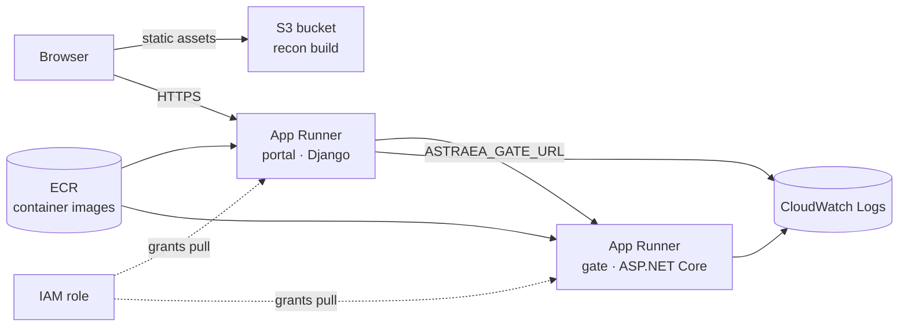

# The AWS stack, in plain terms

**Live (us-east-2, account 793140950071):**
[gate](https://gate.thessa.space/healthz) ·
[lookup](https://gate.thessa.space/lookup) ·
[portal](https://portal.thessa.space/admin/) (`demo` / `astraea-demo`)

What each AWS service in this deployment actually is, why it is here rather
than an alternative, and what it costs. Written for a reader who knows software
but not necessarily this cloud — every entry answers *what it does*, *what it
holds for Astraea*, and *what happens if it goes away*.

The whole system is three deployable pieces:

| piece | what it is | runs on |
|---|---|---|
| **gate** | ASP.NET Core 8 service — reconciliation, ontology law, node lookup | App Runner |
| **portal** | Django 5 + gunicorn — the adjudication queues | App Runner |
| **recon** | React single-page app — briefing viewer, primer, 3D atlas | S3 (+ CloudFront) |



---

## IAM — who is allowed to do what

**What it is.** AWS's permission system. Every action, by a person or by a
service, is allowed or denied by an IAM policy. Nothing in AWS happens without
an identity attached.

**Two identities exist here, deliberately separated:**

- **`astraea-deployer`** — an IAM *user* with an access key, used only from the
  command line to run the deploy. It has no console password. If this key ever
  leaked, it is revoked in one click without touching the account itself.
- **`astraea-apprunner-ecr-access`** — an IAM *role* that App Runner assumes on
  its own behalf. A role has no password or key: a service temporarily "wears"
  it. This one grants exactly one capability — pull images from ECR — because
  App Runner needs to fetch a container it does not otherwise have rights to.

**The root user is not in this picture.** Root can close the account and change
billing; it is protected with MFA and then left alone. That separation — never
operate as the identity that can destroy everything — is the whole point of IAM.

**Cost:** free.

---

## STS — proving who you are

**What it is.** Security Token Service, the API behind `aws sts
get-caller-identity` — the "whoami" of AWS, and the machinery that issues the
short-lived credentials a role assumption produces.

**Why it matters here:** it is the pre-flight check before any deploy. If STS
answers with the `astraea-deployer` ARN, the credentials on the machine are
real and the ship can proceed. Phase 3 leans on it harder: GitHub Actions will
call STS through OIDC federation to get temporary credentials, so no long-lived
key exists anywhere.

**Cost:** free.

---

## ECR — the private container registry

**What it is.** Elastic Container Registry: Docker Hub, but private and inside
your account. Images are pushed to it and pulled by anything in AWS that runs
containers.

**What it holds for Astraea:** two repositories, `astraea-gate` and
`astraea-portal`. The images themselves are built by GitHub Actions (which can
reach Microsoft's container registry when this workstation cannot), published
to GitHub Container Registry, then pulled down and pushed into ECR by the ship
script. ECR is the handoff point between "built" and "running".

**Why not run straight from ghcr?** App Runner pulls from ECR natively with an
IAM role; any other registry means managing registry credentials as secrets.
Using the cloud's own registry removes a credential from the system.

**Cost:** ~$0.10/GB-month. Two images ≈ 400 MB ≈ **$0.05/month**.

---

## App Runner — managed containers

**What it is.** You hand AWS a container image and a port; it runs the
container, gives it an HTTPS URL with a valid certificate, load-balances it,
health-checks it, restarts it when it dies, and scales it out under load. No
servers, no clusters, no ingress controllers, no certificate renewal.

**What it runs for Astraea:** two services.

- `astraea-gate` on port 8080, health-checked at `/healthz`
- `astraea-portal` on port 8000, health-checked at `/admin/login/`

They find each other by environment variable: the portal receives
`ASTRAEA_GATE_URL` pointing at the gate's public HTTPS URL, and the gate
receives `PortalOrigins` so its CORS policy trusts the portal. Both hostnames
only exist after creation, which is why the ship script deploys, reads the
assigned URLs, then redeploys with them — a two-pass wiring step that is normal
for any pair of services that must know each other's addresses.

**Why App Runner and not the alternatives** — the trade-off worth being able to
defend out loud:

- **Lambda** is the reflex answer for "small and cheap", but Django on Lambda
  needs an adapter shim, cold starts hurt an interactive admin, and the gate is
  a long-lived HTTP service, not an event handler.
- **ECS/Fargate** runs the same containers with far more surface area: task
  definitions, services, target groups, load balancers, listener rules. That is
  the right answer at scale and unnecessary ceremony for two services.
- **EKS (Kubernetes)** adds node pools, upgrades, ingress, and RBAC to operate.
  Being able to name why *not* to reach for Kubernetes is worth more than
  reciting its vocabulary.
- **Lightsail** is cheaper and reads as hobbyist.

**Cost:** billed for provisioned memory continuously and vCPU only while
serving requests. At 0.25 vCPU / 0.5 GB, two mostly-idle services ≈
**$4–7/month** — the bulk of the bill.

---

## S3 — object storage for the static app

**What it is.** Object storage: buckets holding files, addressed by key,
effectively unlimited and priced per GB. Not a filesystem — there are no real
directories, just keys with slashes in them.

**What it holds for Astraea:** the compiled `recon` build — the JavaScript
bundle plus ~14 MB of atlas JSON (147 metabolic subsystems). This is a pure
static payload with no server behind it, which is exactly S3's sweet spot: the
3D atlas is *data files a browser fetches*, not a service that computes.

**Cost:** ~$0.023/GB-month plus request charges. Under 1 GB ≈ **~$0.10/month**.

---

## CloudFront — the CDN in front of S3

**What it is.** AWS's content delivery network: a global cache of edge
locations, so a visitor in Frankfurt fetches from Frankfurt instead of Ohio. It
also terminates HTTPS and is where a custom domain and ACM certificate attach.

**Status here:** the natural follow-up, deliberately deferred so the domain and
certificate decision comes first. S3 serves the app fine without it; CloudFront
adds latency improvement, edge caching of that 14 MB atlas, and a place to put
`astraea.yourdomain.com`.

**Cost:** free tier covers 1 TB/month egress; realistically **~$0–1/month**.

---

## CloudWatch Logs — where the output goes

**What it is.** The default destination for logs from AWS services. App Runner
ships two streams per service automatically: *service* logs (the platform's own
deployment and health-check activity) and *application* logs (whatever the
container writes to stdout/stderr).

**Why it matters here:** it is the first place to look when a service will not
turn healthy. A container that exits immediately, a Django `ALLOWED_HOSTS`
rejection, a failed image pull — each leaves a specific line here rather than
requiring a guess.

**Cost:** ~$0.50/GB ingested; a demo generates pennies. Set a retention policy
(logs default to *never expire*) if this ever runs long-term.

---

## What the whole thing costs

| item | monthly |
|---|---|
| App Runner ×2 (0.25 vCPU / 0.5 GB, idle-ish) | $4–7 |
| S3 + CloudFront | ~$1 |
| ECR storage | ~$0.05 |
| IAM, STS, CloudWatch (demo volume) | ~$0 |
| **total** | **~$6–9** |

Set a billing alarm (Billing → Budgets → a $15 monthly budget with an email
alert) so a surprise is impossible.

---

## Operating it

**Redeploy after a code change.** Push to `main`; GitHub Actions builds and
publishes both images; then:

```powershell
./deploy/ship-phase2.ps1 -Region us-east-2
```

The script is re-runnable: existing repositories, roles, and services are
reused and updated rather than recreated.

**Watch a service that will not start.**

```bash
aws apprunner list-services --region us-east-2
aws logs tail /aws/apprunner/astraea-gate --region us-east-2 --follow
```

**Tear it all down** (billing stops):

```bash
aws apprunner delete-service --service-arn <gate-arn>   --region us-east-2
aws apprunner delete-service --service-arn <portal-arn> --region us-east-2
aws ecr delete-repository --repository-name astraea-gate   --force --region us-east-2
aws ecr delete-repository --repository-name astraea-portal --force --region us-east-2
aws s3 rb s3://astraea-recon-<account-id> --force
```

---

## What is deliberately *not* deployed

The live knowledge graph never leaves the workstation. The cloud runs seeded
public-data demo mode only: the portal image bakes a fresh SQLite database at
build time from the committed seed, and it resets on every deploy. No RDS, no
personal data, no state worth protecting — and the settings are already
environment-driven, so swapping `DATABASES` to RDS Postgres is a configuration
change rather than a rewrite when a real multi-tenant deployment needs one.
