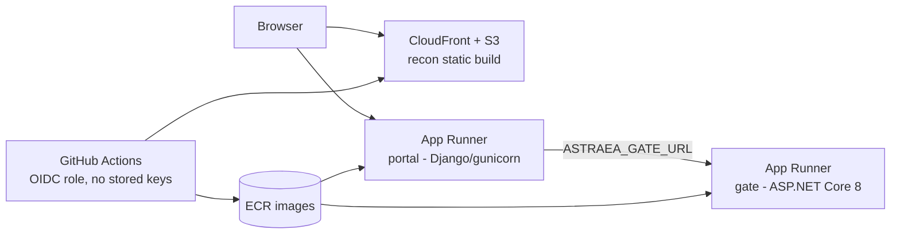

# AWS deployment — scope

Target: the public demo of Astraea running on AWS at portfolio cost (≤ ~$12/month),
with an architecture that reads like production engineering, not a tutorial.

## What deploys (and what deliberately does not)

| piece | runtime | deploys as | state |
|---|---|---|---|
| `recon/` viewer (RECON + PRIMER + ATLAS) | static after `vite build` | **S3 + CloudFront** | none — atlas JSON ships as static assets |
| `gate/` Astraea.Gate | ASP.NET Core 8 container | **App Runner** (via ECR) | stateless |
| `portal/` adjudication | Django 5 + gunicorn container | **App Runner** (via ECR) | seeded SQLite **baked into the image** |
| live-KG mode (`import_kg`, real queues) | — | **stays local, by design** | the graph is private; the cloud runs seeded demo mode only |

The baked-SQLite decision is deliberate and disclosed: the demo database is
seeded public data, rebuilt on every image build (`migrate` + `seed_proposals` +
a read-only demo reviewer account), and resets on redeploy. That keeps the
public instance immutable and honest — no RDS cost, no PII surface, no state to
protect. A real multi-tenant deployment would swap `DATABASES` to RDS Postgres;
the settings are already env-driven.

## Architecture

Why App Runner over the alternatives, in one line each: Lambda would need
apig-wsgi contortions for Django and buys nothing at this traffic; ECS/Fargate
is the same containers with more ops surface; Lightsail is cheaper but reads as
hobbyist in an interview. App Runner is the managed-container story with HTTPS,
autoscaling, and per-service health checks out of the box.

## Cost estimate (us-east-1, demo traffic)

| item | monthly |
|---|---|
| App Runner ×2 (0.25 vCPU / 0.5 GB, mostly idle — provisioned memory only) | ~$4–7 |
| S3 + CloudFront (≤1 GB, low egress; atlas JSON ~14 MB cached at edge) | ~$1 |
| ECR storage (2 images, ~400 MB) | ~$0.50 |
| Route 53 hosted zone (optional custom domain) | $0.50 |
| **total** | **~$6–9** |

## Status

**Phase 1 complete, fully verified.** Both images build in CI
(`.github/workflows/build.yml`: gate xUnit + portal Django suites gate the
builds; images publish to ghcr.io with `latest` + sha tags) — CI became the
image factory when the original build machine couldn't reach
`mcr.microsoft.com`. Cross-container loop verified live: the ghcr-built gate
answering `/healthz` from the portal's network, and `manage.py run_gate`
inside the portal adjudicating the baked demo data against the containerized
gate with correct named verdicts. The baked db carries exactly the public
seed and zero live-KG rows.

**Phase 2 scripted, awaiting credentials.** `deploy/ship-phase2.ps1` executes
the whole ship — ECR repos + pushes, the App Runner ECR-access role, both
services with env wiring (gate URL into the portal, portal origin into the
gate's CORS, generated `DJANGO_SECRET_KEY`), and the S3 sync — once the
operator has run `aws configure`. CloudFront distribution is the scripted
follow-up after the domain/cert decision. API-plane reachability from the
build machine is confirmed (STS TLS clean) even while Amazon's CDN hosts are
not.

## Phases

1. **Containerize** — `gate/Dockerfile` (multi-stage: sdk → aspnet runtime,
   `PortalOrigins` env), `portal/Dockerfile` (python-slim, gunicorn + whitenoise
   for admin static files, entrypoint runs migrate/seed/createsuperuser from
   env, `DJANGO_*` + `ASTRAEA_GATE_URL` env). Verify both with local
   `docker run` + the existing test suites before any AWS step.
2. **Ship by hand once** — ECR push, two App Runner services, S3 bucket +
   CloudFront distribution for `recon/dist` (`--base` set for assets). Wire
   `ASTRAEA_GATE_URL`, `DJANGO_ALLOWED_HOSTS`, `DJANGO_CSRF_TRUSTED_ORIGINS`,
   `DJANGO_SECRET_KEY` (Secrets Manager or App Runner env), `PortalOrigins`.
   Smoke-test the full loop against the live URLs.
3. **Automate** — GitHub Actions with an OIDC-assumed IAM role (no long-lived
   keys in the repo): build/test → push images → update App Runner → sync S3 +
   invalidate CloudFront. This phase is the resume line.
4. **Optional polish** — custom domain + ACM cert; CDK or Terraform if the
   stack should be reproducible as code.

## Credentials boundary

Account setup, billing, IAM user/role creation, and `aws configure` are the
operator's steps — credentials never enter tooling, scripts, or the repo. The
GitHub Actions role uses OIDC federation, so no AWS secret is ever stored in
GitHub either.
