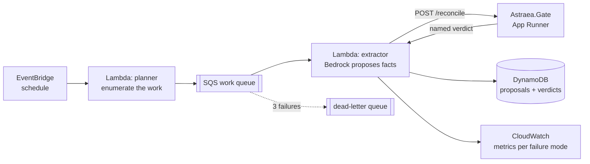

# The flywheel, cloud-native

The extraction flywheel that proposes facts for Astraea's gate to judge, moved
off a workstation GPU and onto event-driven AWS — without changing the thesis.
Nothing here publishes anything. It fills a queue a human adjudicates.



## Why each piece is here

| piece | why |
|---|---|
| **EventBridge rule** | The flywheel is a cadence, not a request. A cron expression is the whole scheduler; there is no server waiting to be woken. |
| **SQS work queue** | Decouples *deciding what to extract* from *extracting it*, so a slow model call cannot stall enumeration, and concurrency is a queue setting rather than a code change. |
| **Dead-letter queue** | After three failed receives a message parks instead of poisoning the queue forever. The DLQ depth is the alarm that says extraction is broken. |
| **Extractor Lambda** | Per-message compute that scales to zero. Calls Bedrock for the proposal, then calls the gate for the verdict — proposing and judging stay separate processes, as they must. |
| **DynamoDB** | Proposal + verdict per company/period, keyed so a redelivery overwrites rather than duplicates. That is the idempotency story, and it is why at-least-once delivery is safe here. |
| **CloudWatch metrics** | One metric per named failure mode. "Extraction quality" stops being a feeling and becomes a graph of `unreconciled` over time. |

## Idempotency, concretely

SQS is at-least-once: a consumer that exceeds its visibility timeout will see
the same message again. Every write therefore uses a deterministic key —
`{company}#{fiscal_year}` — so reprocessing rewrites one item instead of
appending a second. The extractor also stamps `attempt` and
`source_message_id`, so a duplicate is visible in the data rather than hidden
by it.

## What it costs

Lambda and SQS sit inside the perpetual free tier at this volume; DynamoDB
on-demand is pennies; Bedrock bills per token. A daily run over a handful of
companies is **under $1/month**, and `cdk destroy` removes all of it.

## Deploying

```bash
cd flywheel
npm install
npx cdk bootstrap          # once per account/region
npx cdk deploy
```

The stack takes the gate's URL as a parameter so the extractor knows where to
send proposals for judgment.

---

## What the first live runs found

Two model families, the same four companies, the same gate:

| company | Claude Haiku 4.5 | Nova 2 Lite |
|---|---|---|
| Apple FY2023 | publishable (−0.13%) | **unreconciled** |
| Microsoft FY2023 | — | publishable |
| Intel FY2023 | **unreconciled** (+2.62%) | publishable |
| NVIDIA FY2024 | **unreconciled** (−3.28%) | publishable |

Neither model is reliably right, and that is the entire point. The gate is the
invariant: whichever model proposes, a segment sum that does not tie to the
consolidated figure is refused by name, and only what survives reaches a human.
Swapping the proposer is one environment variable — the verdict logic never
moves.

## Three bugs the deployment found

1. **`bedrock_invoke_failed: ValidationException`** — current Anthropic models
   must be invoked through a cross-region *inference profile*
   (`us.anthropic.…`), not the bare foundation-model id.
2. **`ResourceNotFoundException: Model use case details have not been
   submitted`** — Anthropic models on Bedrock need a one-time use-case form per
   account. Nova needs none, so it is the default; the switch is one variable
   because the extractor calls the **Converse API** rather than a
   provider-specific request body.
3. **`AccessDenied` on `PutMetricData`** — the extractor role could write
   DynamoDB and call Bedrock but not emit metrics. Every message therefore
   stored its verdict, *then* failed, and SQS redelivered work that was already
   durably recorded. The deterministic partition key meant those redeliveries
   rewrote one item instead of creating duplicates — idempotency doing exactly
   its job. Fixed by granting the permission and by making metric emission
   best-effort-but-loud: observability must not be able to fail a message whose
   record already exists.
